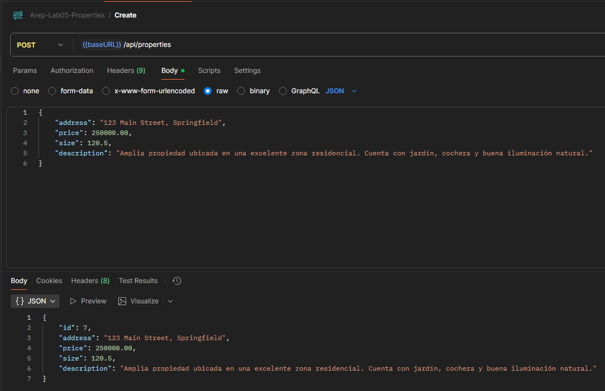
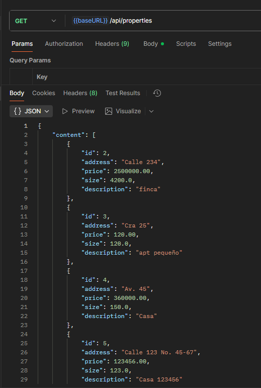
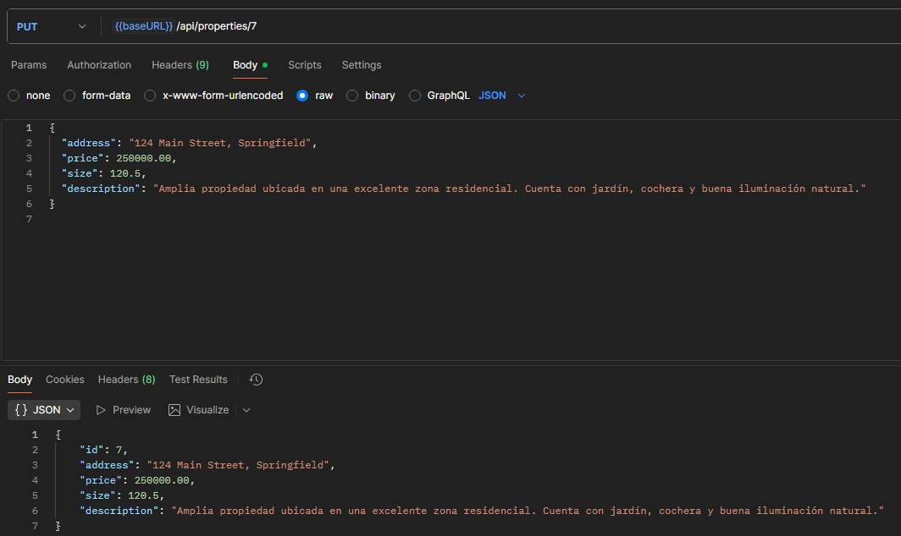
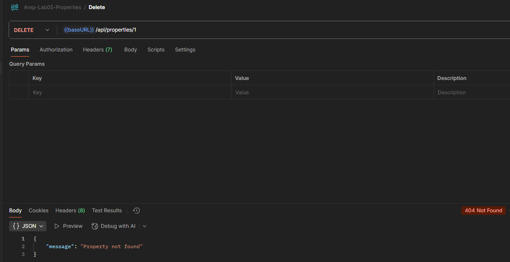
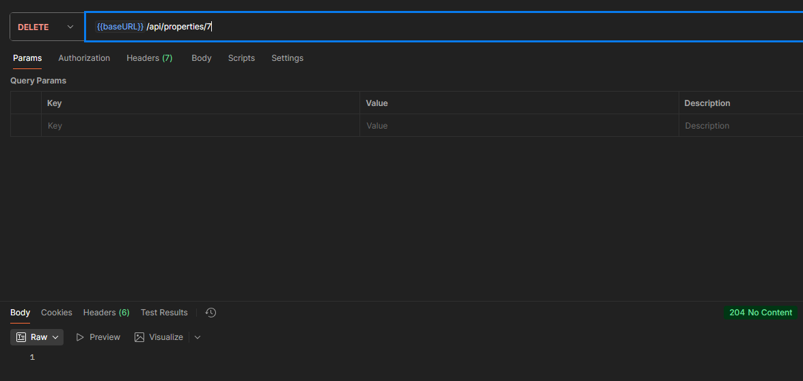

# AREP-Lab06-SpringSecurity
Proyecto: Sistema CRUD para gestión de propiedades con Seguridad

## Resumen del proyecto
Este repositorio contiene una aplicación backend en Java (Spring Boot) que implementa un sistema CRUD para gestionar propiedades (inmuebles). La API permite crear, leer, actualizar y eliminar propiedades, además de búsquedas avanzadas por dirección, texto libre, rango de precio y rango de tamaño.
En este laboratorio se extendió el proyecto anterior añadiendo **autenticación segura*, **transmisión cifrada (TLS)** y **despliegue en infraestructura distribuida en AWS**.

Principales responsabilidades:
- Almacenar y consultar propiedades en una base de datos MySQL.
- Exponer endpoints REST para operaciones CRUD y búsqueda.
- Validar entradas y manejar errores de forma centralizada.

## Video de despliegue
https://youtu.be/FIiJlfcocHw

<video src="https://youtu.be/FIiJlfcocHw" controls width="720"></video>


## Características de Seguridad Implementadas

### 1 Autenticación HTTP Basic
- La API protege todos los endpoints bajo `/api/**` usando **Spring Security**.  
- El esquema de autenticación es **HTTP Basic sobre TLS**, por lo que las credenciales viajan cifradas.
- No se utiliza JWT ni sesiones: Spring valida las credenciales en cada request (stateless).

### 2 Usuarios y contraseñas seguras
- Los usuarios se almacenan en una tabla `users` de MySQL.  
- La contraseña se guarda **hasheada con BCrypt** (no texto plano).  
- Al iniciar la aplicación, se crea automáticamente un usuario **admin** con rol `ADMIN`:

```
usuario: admin
contraseña: ***
```
(configurable desde `UserServiceImpl`).

### 3 Configuración de Spring Security
```java
http
	.csrf(csrf -> csrf.disable())
	.cors(cors -> cors.configurationSource(corsConfigurationSource()))
	.sessionManagement(sm -> sm.sessionCreationPolicy(SessionCreationPolicy.STATELESS))
	.authorizeHttpRequests(auth -> auth
			.requestMatchers(HttpMethod.GET, "/actuator/health").permitAll()
			.requestMatchers("/auth/**").permitAll()
			.requestMatchers("/api/**").authenticated()
			.anyRequest().permitAll()
	)
	.httpBasic(Customizer.withDefaults());
.httpBasic(Customizer.withDefaults());
```

* Todos los endpoints `/api/**` requieren autenticación.
* CORS habilitado solo para el dominio HTTPS del frontend (`https://jemrareptaller6.duckdns.org`).

### 4 Transmisión cifrada (TLS)

* Tanto el **frontend (Apache)** como el **backend (Nginx + Spring)** utilizan **certificados TLS de Let's Encrypt**.
* Todo el tráfico se transmite por **HTTPS**, garantizando **confidencialidad** e **integridad**.
* En Nginx (backend), el proxy maneja TLS y reenvía las peticiones internas hacia Spring en `localhost:8080`.


## Arquitectura del sistema

Componentes principales:
- **EC2 #1 (Frontend)**: Apache + Certbot TLS. Sirve los archivos estáticos (HTML, JS, CSS). Apunta al dominio `https://jemrareptaller6.duckdns.org`.
- **EC2 #2 (Backend)**: Nginx (proxy con TLS) + contenedor Docker de Spring Boot. Atiende `https://api-jemrareptaller6.duckdns.org` y reenvía a `localhost:8080`.
- **MySQL (Docker)**: Corre en el mismo backend EC2 dentro de Docker Compose junto a la aplicación.

### Diagrama

```
		[ Usuario / Navegador ]
				│ HTTPS (TLS)
				▼
 ┌─────────────────────────────────────┐
 │ Apache (Front EC2)            	   |
 │ - Sirve login.html / index.html / JS|
 │ - HSTS, CSP, TLS, headers seguros   │
 └──────────────┬──────────────────────┘
                │ HTTPS (TLS)
                ▼
	┌──────────────────────────────┐
	│ Nginx (Backend EC2)          │
	│ - TLS proxy (Let's Encrypt)  │
	│ - ProxyPass a localhost:8080 │
	│ Spring Boot (Docker)         │
	│ - API REST CRUD /auth /api   │
	│ - BCrypt + HTTP Basic        │
	└──────────────────────────────┘
                │
                ▼
       MySQL (Docker Container)
```

Interacción:
1. El usuario abre `https://jemrareptaller6.duckdns.org/`.
2. Ingresa sus credenciales (`admin / ***`).
3. El frontend envía una petición con `Authorization: Basic <Base64>` al backend.
4. Si la autenticación es exitosa, el token se guarda temporalmente en `sessionStorage` y el usuario es redirigido al `index.html`.
5. Todos los `fetch()` desde `script.js` incluyen automáticamente el header `Authorization` para acceder a la API.
6. Si el usuario hace logout o la sesión expira, vuelve al login.

Diagrama simplificado:

Client <--HTTP--> Backend (Spring Boot) <--JPA/Hibernate--> MySQL

En local se puede ejecutar con Docker Compose: el contenedor `mysql` y el contenedor `app` se comunican usando la red definida en `docker-compose.yml`.

## Base de datos

El sistema usa **MySQL 8** en contenedor Docker.
Las tablas se generan automáticamente mediante `spring.jpa.hibernate.ddl-auto=update`.

Entidad principal:

* **Property**

  * `id`, `address`, `price`, `size`, `description`
* **User**

  * `id`, `username`, `password (BCrypt)`, `role`, `enabled`

## Diseño de clases (overview)

Componentes principales del backend:

- `co.edu.escuelaing.propertiesapi.model.entity.Property`
	- Entidad JPA que representa una propiedad.
	- Campos: `id: Long`, `address: String`, `price: BigDecimal`, `size: Double`, `description: String`.

- `co.edu.escuelaing.propertiesapi.model.dto.PropertyDto`
	- DTO usado para recibir/validar datos en las APIs.
	- Contiene validaciones (`@NotBlank`, `@NotNull`, `@Positive`, etc.).

- `co.edu.escuelaing.propertiesapi.repository.PropertyRepository`
	- Extiende `JpaRepository<Property, Long>` y `JpaSpecificationExecutor<Property>` para consultas paginadas y filtradas.

- `co.edu.escuelaing.propertiesapi.service.PropertyService` (interface)
	- Define operaciones: `create`, `list(Pageable)`, `get`, `update`, `delete`, `search(...)`.

- `co.edu.escuelaing.propertiesapi.service.impl.PropertyServiceImpl`
	- Implementación de `PropertyService`.
	- Maneja lógica de negocio y lanza `NoSuchElementException` cuando no encuentra recursos.

- `co.edu.escuelaing.propertiesapi.controller.PropertyController`
	- Expones los endpoints REST (GET/POST/PUT/DELETE) y delega al servicio.
	- Usa `@Valid` para validar `PropertyDto` y devuelve `201 Created` en creación.

- `co.edu.escuelaing.propertiesapi.controller.GlobalExceptionHandler`
	- Manejador global (`@ControllerAdvice`) que captura `MethodArgumentNotValidException`, `NoSuchElementException`, `DataIntegrityViolationException`, `ConstraintViolationException` y excepciones generales para mapearlas a respuestas HTTP adecuadas (400/404/409/500).

## Endpoints principales

Ejemplos (asumimos base `/api/properties`):
- GET `/api/properties` -> listar (paginado) / búsqueda con parámetros opcionales (address, q, minPrice, maxPrice, minSize, maxSize, page, size)
- GET `/api/properties/{id}` -> obtener por id
- POST `/api/properties` -> crear (body: `PropertyDto`)
- PUT `/api/properties/{id}` -> actualizar
- DELETE `/api/properties/{id}` -> eliminar

## Instrucciones de despliegue

Requisitos previos:
- Java 17+ y Maven para generar el `jar` localmente.
- Docker y Docker Compose para pruebas locales.
- Cuenta AWS con permisos para ECS/EC2/RDS según la opción de despliegue.

1) Construir artefacto Java (local)

```bash
mvn clean package
```

2) Construir imagen Docker localmente

```bash
docker build -t rivitas13/arep-spring-security .
```

3) Ejecutar en local con Docker Compose (levanta MySQL y la app)

```bash
docker-compose up --build
```

Ajustes importantes en `docker-compose.yml`:
- El servicio `mysql` expone el puerto 3306 y tiene variables de entorno para la contraseña/usuario.
- El servicio `app` usa variables `SPRING_DATASOURCE_URL`, `SPRING_DATASOURCE_USERNAME`, `SPRING_DATASOURCE_PASSWORD` y el `SPRING_PROFILES_ACTIVE`.

4) Publicar la imagen en Docker hub

- Crear un repositorio en dockerhub (o usar uno existente).

```bash
docker push rivitas13/arep-spring-security
```

5) Despliegue en AWS (2 EC2)

### EC2 Frontend (Apache + Certbot)
```bash
sudo yum update -y
sudo dnf install -y httpd python3 python3-venv
sudo systemctl enable --now httpd

# Archivos web (login.html, index.html, script.js)
sudo mkdir -p /var/www/html
sudo cp -r ./frontend/* /var/www/html/

# Configurar VirtualHost con TLS
sudo certbot-3 --apache -d jemrareptaller6.duckdns.org -m tu-correo@dominio.com --agree-tos -n
```

### EC2 Backend (Nginx + Docker Compose)
```bash
sudo yum update -y
sudo yum install -y docker python3 python3-venv
sudo systemctl enable --now docker

# Certificados TLS
sudo python3 -m venv /opt/certbot
sudo /opt/certbot/bin/pip install certbot certbot-nginx
sudo ln -s /opt/certbot/bin/certbot /usr/local/bin/certbot
sudo certbot certonly --standalone -d api-jemrareptaller6.duckdns.org --agree-tos -m tu-correo@dominio.com -n
```

#### Nginx proxy (`/etc/nginx/conf.d/api.conf`)

```nginx
server {
	listen 80;
	server_name api-jemrareptaller6.duckdns.org;
	return 301 https://$host$request_uri;
}

server {
	listen 443 ssl;
	server_name api-jemrareptaller6.duckdns.org;

	ssl_certificate /etc/letsencrypt/live/api-jemrareptaller6.duckdns.org/fullchain.pem; # managed by Certbot
	ssl_certificate_key /etc/letsencrypt/live/api-jemrareptaller6.duckdns.org/privkey.pem; # managed by Certbot

	location / {
		proxy_pass http://127.0.0.1:8080;
		proxy_set_header Host $host;
		proxy_set_header X-Real-IP $remote_addr;
		proxy_set_header X-Forwarded-For $proxy_add_x_forwarded_for;
		proxy_set_header X-Forwarded-Proto $scheme;
		proxy_set_header Authorization $http_authorization;
	}

}
```

#### Docker Compose (Backend EC2)

```yaml
version: "3.8"

services:
  mysql:
    image: mysql:8.0
    container_name: mysql_props
    restart: unless-stopped
    environment:
      MYSQL_ROOT_PASSWORD: root
      MYSQL_DATABASE: properties
    volumes:
      - mysql_data:/var/lib/mysql
    healthcheck:
      test: ["CMD", "mysqladmin", "ping", "-h", "127.0.0.1", "-proot"]
      interval: 5s
      timeout: 3s
      retries: 10

  app:
    image: rivitas13/arep-spring-security:latest
    container_name: properties-api
    restart: unless-stopped
    depends_on:
      mysql:
        condition: service_healthy
    environment:
      SPRING_DATASOURCE_URL: jdbc:mysql://mysql:3306/properties?createDatabaseIfNotExist=true&allowPublicKeyRetrieval=true&useSSL=false&serverTimezone=UTC
      SPRING_DATASOURCE_USERNAME: root
      SPRING_DATASOURCE_PASSWORD: root
      SPRING_PROFILES_ACTIVE: prod
    ports:
      - "8080:8080"

volumes:
  mysql_data:
```

Levantar todo:

```bash
sudo docker compose up -d
sudo systemctl enable nginx --now
```

---

## Manejo de errores y buenas prácticas
- Validar DTOs con anotaciones `jakarta.validation` para asegurar entradas correctas.
- Manejar excepciones de BD (`DataIntegrityViolationException`, `ConstraintViolationException`) en el `@ControllerAdvice` y mapear a 400/409 cuando proceda.

## Screenshots (placeholders)

Pruebas de los endpoints:

1. Crear una propiedad (POST):



2. Listar (GET):



3. Actualizar (PUT) y Eliminar (DELETE) para completar flujo CRUD.

**Actualizar una propiedad**


**Eliminar una propiedad no existente**


**Eliminar una propiedad**



## Tecnologías principales

* **Spring Boot 3.5.6**
* **Spring Security + BCrypt**
* **Hibernate / JPA**
* **MySQL 8**
* **Docker + Docker Compose**
* **Apache HTTP Server (Frontend)**
* **Nginx (Backend proxy)**
* **Let's Encrypt (TLS)**

---

## Autor

Juan Esteban Medina Rivas - Universidad Escuela Colombiana de Ingeniería Julio Garavito

---

**En esta versión del laboratorio se cumple con:**

* Autenticación con contraseñas seguras (BCrypt).
* Comunicación cifrada TLS extremo a extremo.
* Arquitectura distribuida (2 EC2: Apache + Nginx).
* Frontend asíncrono protegido.
* Despliegue automatizado vía Docker Compose.

---

Versión: 1.0 — documentación inicial generada.


